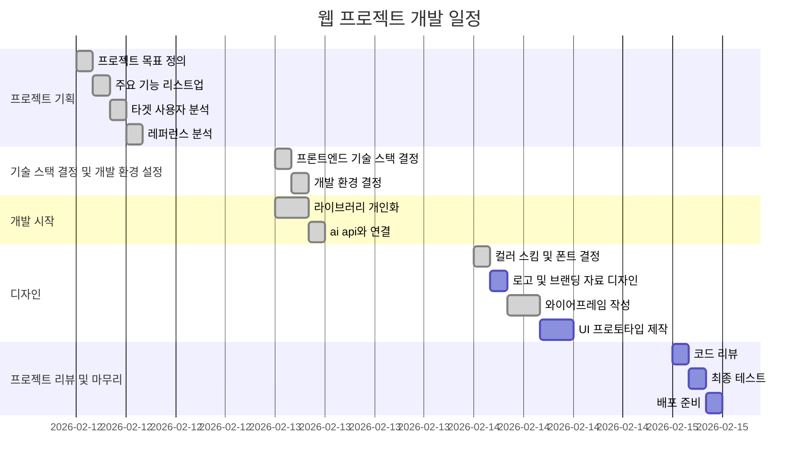
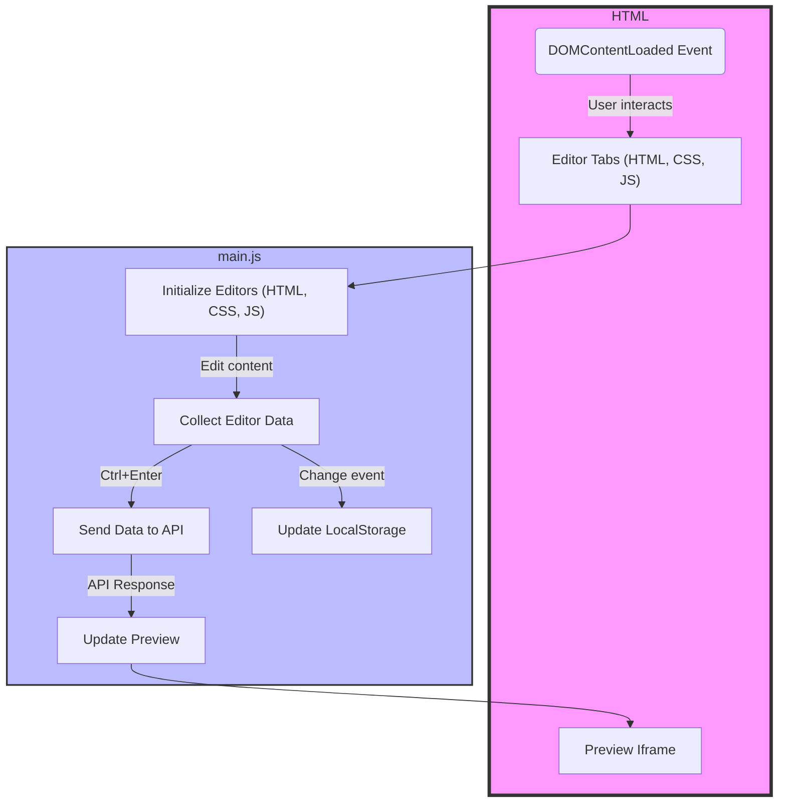

# Code Helper: Real-time GPT-3.5 Integration for Code Editors


Code Helper는 간단한 코드 플레이 그라운드에 GPT-3.5를 직접 통합하였습니다. GPT-3.5가 생산하는 코드를 눈으로 확인하며 작업할 수 있으며, 매 요청은 local storage에 저장되어 간단히 불러올 수 있습니다.

## 기능

- **실시간 코드 제안**: GPT-3.5의 제안을 활용해 자연어 타이핑으로 코드 제안을 받습니다.
- **디버깅 지원**: 문제를 설명하여 GPT 모델로부터 디버깅 도움을 받습니다.
- **맞춤형 통합**: 로컬에서 개인화된 프롬프트 학습이 가능합니다.

## 일정(진행중)



## 폴더 구조

- `./assets`: 프로젝트에 들어가는 asset 파일을 보관합니다.
- `/constants`: 프로젝트 설정을 위한 상수 값을 보관합니다.
- `/scripts`: API 상호작용 및 UI 동적 기능을 포함하는 JavaScript 파일이 들어 있습니다.
- `/styles`: 코드 에디터 및 추가 UI 컴포넌트 스타일링을 위한 CSS 파일을 저장합니다.
- `index.html`: 애플리케이션의 메인 HTML 구조가 있는 진입점입니다.



## 사용 스택

- `TailwindCSS` : 유틸리티 퍼스트 CSS 프레임워크로 간편한 프리셋과 적은 용량, 높은 자유도를 가졌습니다. 여기서는 빠른 개발을 위해 차용하였습니다.
- `Axios`: 외부 API와의 요청을 위한 프라미스 기반 HTTP 클라이언트입니다. 프로젝트 내 API와 상호작용하는 데 사용됩니다.
- `CodeMirror`: 브라우저에서 JavaScript로 구현된 다재다능한 텍스트 에디터입니다. 구문 강조 표시 및 코드 형식 지정을 포함한 풍부한 코드 편집 환경을 제공하는 데 사용됩니다.
- `DOMPurify`: 원하지 않는 태그와 잠재적으로 위험한 속성으로부터 HTML을 정화하고 청소하는 라이브러리입니다. 문서에 삽입된 내용의 보안을 보장합니다.

## 디자인

- 베타테스트 중인 [오븐](https://ovenapp.io/)으로 제작.

[프로젝트 공유 주소](https://ovenapp.io/project/LLeTcbHXVAF1Ik78vYsnXZaYn2XP2Aqr#ILUPO)

### 와이어프레임


### 와이어프레임 - 모바일


## 시작하기

Code Helper를 시작하려면 이 저장소를 클론하고 `index.html`을 브라우저에서 열어보세요. GPT-3.5 API와 통신하기 위해 인터넷 접속이 필요합니다. git page에서 열 수 있습니다. 제작중.

```bash
git clone https://github.com/matty255/code-helper.git cd code-helper
# live-server를 사용하여 index.html 열기

```

## 사용 방법

코드 에디터에서 타이핑을 시작하면 GPT-3.5 제안을 볼 수 있습니다. 키보드를 떠나지 않고 실시간 도움을 받으려면 `Ctrl+Enter` 단축키를 사용하세요.
