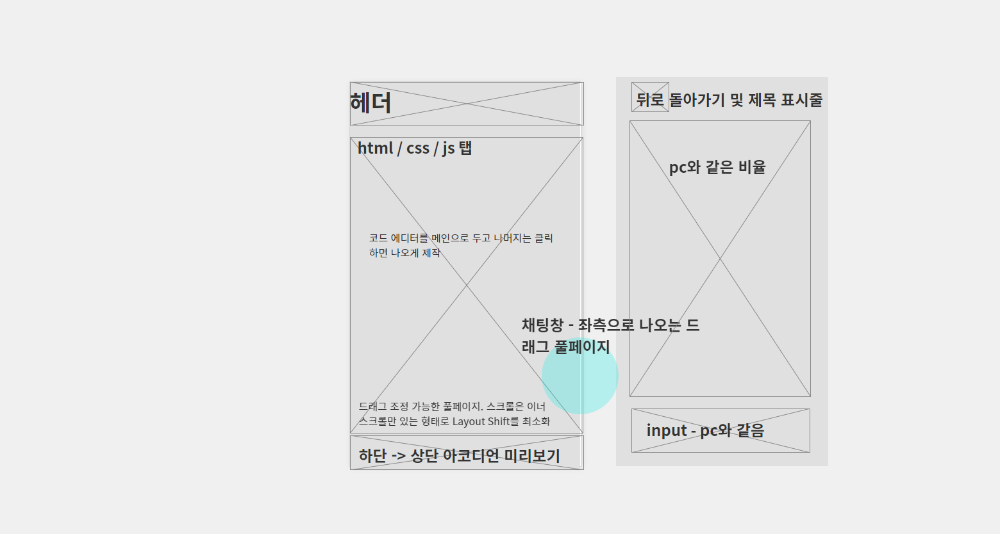

# Code Helper: GPT-3.5 Integration for Code Editors


Code Helper는 간단한 코드 플레이 그라운드에 GPT-3.5를 직접 통합하였습니다. GPT-3.5가 생산하는 코드를 눈으로 확인하며 작업할 수 있으며, 매 요청은 local storage에 저장되어 간단히 불러올 수 있습니다.

## 목적

`code-helper` 이 프로젝트를 시작한 건, 간단한 궁금증에서 비롯되었습니다.

> "`cdn`만으로 과연 어디까지 할 수 있을까?"

이 호기심은 프레임워크 없이 cdn, JavaScript, HTML, CSS만을 이용해 어떤 멋진 것들을 만들 수 있을지 탐구하는 의미로 제작되었습니다.

이 도전은 프레임워크나 라이브러리 없이도 웹 개발이 여전히 매력적이고, 생산적일 수 있음을 탐색하는 기회였습니다. CDN을 통해 필요한 자원을 불러오면서 10년 전의 웹 개발에 대해서 상상해보는 시간을 가졌습니다. 힘든 점도 물론 많았습니다. 일단 Github Pages로 배포해야 했기에 서버리스가 날아갔고, 대부분의 외부 api를 사용할 수 없었기 때문에 프로젝트의 깊이가 크게 제한되었습니다(api 제공에 감사를).

typescript와 lint를 사용할 수 없으니 버그 하나 나면 괄호 수를 세어가며 디버깅을 하고, 평소 즐겨쓰던 TailwindCSS가 가진 대부분의 기능이 postCSS 전처리에서 비롯된다는걸 깨달으면서 브라우저 환경이란 무엇인가 깊이 생각해보는 계기가 되었습니다. 오랜만에 즐거웠습니다. 개발이 왜 재미있었는지 다시 기억하게 되었습니다.

이 프로젝트는 4월에 제공받은 공개 api가 만료되면 더 이상 볼 수 없습니다. 또한 브라우저의 Local Storage에 질문과 답변 정보를 저장하고 있어 보안에 취약합니다. 말 그대로 기술 테스트용으로 사용에 주의하시기 바랍니다. 모든 데이터 처리를 클라이언트 측에서 하고 있기 때문에 어떤 정보도 보호하지 못합니다.

code-helper는 호기심에서 시작된 프로젝트이자 웹 개발의 기본으로 돌아가면서도 새롭고 재미있는 것을 만들어보고자 하는 개인적인 탐구의 결과물입니다. 여기에 집약된 작은 아이디어와 시행착오들이, 누군가에게는 새로운 시작점이 되길 희망해봅니다.

## 기능

- **실시간 코드 제안**: GPT-3.5의 제안을 활용해 자연어 타이핑으로 코드 제안을 받습니다.
- **디버깅 지원**: 문제를 설명하여 GPT 모델로부터 디버깅 도움을 받습니다.
- **맞춤형 통합**: 로컬에서 개인화된 프롬프트 학습이 가능합니다.

## Demo

[라이브 데모 링크](https://matty255.github.io/code-helper/)

## 일정


## 폴더 구조

```
📦constants
 ┣ 📜htmlTags.js
 ┗ 📜prompt.js
 📦services
 ┣ 📜ChatUIService.js
 ┣ 📜ConversationServices.js
 ┣ 📜EditorService.js
 ┣ 📜LocalStorageService.js
 ┗ 📜SetEditorValueService.js
📦scripts
 ┣ 📜apiRequests.js
 ┣ 📜buttonToggle.js
 ┣ 📜loading.js
 ┣ 📜main.js
 ┣ 📜setCustomHint.js
 ┣ 📜splitterHandler.js
 ┗ 📜themeToggle.js
 📦styles
 ┣ 📜common.css
 ┣ 📜darkMode.css
 ┣ 📜index.css
 ┗ 📜reset.css
```

- `./assets`: 프로젝트에 들어가는 asset 파일을 보관합니다.
- `./constants`: 프로젝트 설정을 위한 상수 값을 보관합니다.
- `./services`: 클래스로 만들어 재사용할 객체들을 여기에 보관합니다.
- `./scripts`: 코드의 실행을 담당하는 event 관련 JavaScript 파일이 들어 있습니다.
- `./utils`: 간단한 유틸 함수들이 들어 있습니다.
- `./styles`: 코드 에디터 및 추가 UI 컴포넌트 스타일링을 위한 CSS 파일을 저장합니다.
- `index.html`: 애플리케이션의 메인 HTML 구조가 있는 진입점입니다.


## 사용 스택

- **TailwindCSS**: TailwindCSS는 유틸리티 퍼스트 접근 방식을 채택한 CSS 프레임워크로, 개발자가 HTML 문서 내에 직접 스타일 클래스를 적용함으로써, 복잡한 디자인 시스템을 신속하게 구현할 수 있게 합니다. 비록 cdn이라 purge나 custom 기능은 사용하지 못했지만, 강력한 UI를 신속하게 구축할 수 있다는 점에서 망설이지 않고 선택했습니다.
- **Axios**: Axios는 프로미스 기반의 HTTP 클라이언트로, 브라우저와 Node.js 환경 모두에서 사용할 수 있습니다. 이 프로젝트에서는 외부 API와의 통신을 위해 Axios를 활용하여, 비동기 방식으로 데이터를 손쉽게 요청하고 응답을 처리합니다. Axios의 사용은 API 상호작용의 복잡성을 줄이고, 코드의 가독성과 유지 보수성을 향상시킵니다. 사실 한 군데서만 쓴거라 fetch를 썼어도 되었겠지만 fetch보다 axios를 먼저 배운터라 편해서 썼습니다.
- **CodeMirror**: CodeMirror는 웹 기반 프로젝트에서 코드를 편집할 때 필요한 다양한 기능을 제공하는 리치 텍스트 에디터입니다. 구문 강조, 코드 접기, 테마 변경 등 다양한 기능을 지원하여 개발자가 코드를 더 효과적으로 작성하고 수정할 수 있도록 돕습니다. `code-helper` 프로젝트에서는 사용자에게 친숙한 코드 편집 환경을 제공하기 위해 이 라이브러리를 채택했습니다. v6은 역시 대세에 발맞추어 거의 모든 기능이 모듈화되었기 때문에 v5를 사용하고 css 파일만 v6을 가져다 썼습니다.
- **jQuery**: jQuery는 빠르고, 작고, 풍부한 기능을 가진 JavaScript 라이브러리입니다. 복잡한 JavaScript 코드를 간결하고 쉽게 작성할 수 있게 해주며, 이벤트 처리, 애니메이션, AJAX 호출 등을 간편하게 구현할 수 있습니다. `code-helper` 프로젝트에서는 jQuery를 사용하여 DOM 조작과 이벤트 핸들링을 더욱 쉽고 효율적으로 만들어, 개발 과정을 간소화하고 사용자 경험을 향상시켰습니다.

## 디자인

- 베타테스트 중인 [오븐](https://ovenapp.io/)으로 제작.

[프로젝트 공유 주소](https://ovenapp.io/project/LLeTcbHXVAF1Ik78vYsnXZaYn2XP2Aqr#ILUPO)

### 와이어프레임


### 와이어프레임 - 모바일



## 기능

- 모바일, 타블렛, PC를 커버하는 반응형 웹, dark mode 지원, notion 지원
- 채팅 향태로 질문과 답변 내역을 Local Storage에 저장하여 다시 접속시에도 스테이터스를 유지 가능
- 채팅 내역에서 답변을 클릭하면 코드와 구현을 다시 볼 수 있는 모달
- api 응답에 대해 html, css, js를 분리하여 저장하는 에디터
- editor에서 답변을 참조하여 바로 질문하는 기능(Ctrl + Enter)
- 실시간 입력에 따라 html 화면 미리보기 기능

## 메타데이터 및 임베딩


## 트러블슈팅 로그

| 문제                                 | 원인                                                               | 해결방안                                                                                                                                                                                                         |
| ------------------------------------ | ------------------------------------------------------------------ | ---------------------------------------------------------------------------------------------------------------------------------------------------------------------------------------------------------------- |
| 채팅 메시지 삭제 기능                | 채팅 데이터 배열에 `id` 프로퍼티 추가 시 GPT 3.5 API에서 요청 거부 | - `removeIdFromDataArray` 함수를 사용하여 API 요청 시 배열 내의 `id` 제거<br>- `LocalStorageService` 클래스를 확장한 `ConversationService` 클래스 생성하여 API 응답을 배열에 합칠 때 유니크한 `id` 프로퍼티 추가 |
| max-token error                      | 개인화된 프롬프트와 지금까지의 대화 기록을 전송하려 할 때 발생     | - 시스템 프롬프트와 마지막 2개의 대화 기록만 전송으로 변경<br>- 필요 시 API를 상위 티어로 업그레이드                                                                                                             |
| 초기 값 세팅 및 API 응답값 세팅 문제 | Editor에 HTML, CSS, JS가 분리되지 않고 들어감                      | `EditorService` 클래스를 확장한 `SetEditorValueService` 클래스 생성하여 값을 지정하는 부분 고도화                                                                                                                |

## 시작하기

Code Helper를 시작하려면 이 저장소를 클론하고 `index.html`을 브라우저에서 열어보세요. GPT-3.5 API와 통신하기 위해 인터넷 접속이 필요합니다. git page에서 열 수 있습니다.

```bash
git clone https://github.com/matty255/code-helper.git cd code-helper
# live-server를 사용하여 index.html 열기

```

## 사용 방법

코드 에디터에서 타이핑을 시작하면 GPT-3.5 제안을 볼 수 있습니다. 키보드를 떠나지 않고 실시간 도움을 받으려면 `Ctrl+Enter` 단축키를 사용하세요.
